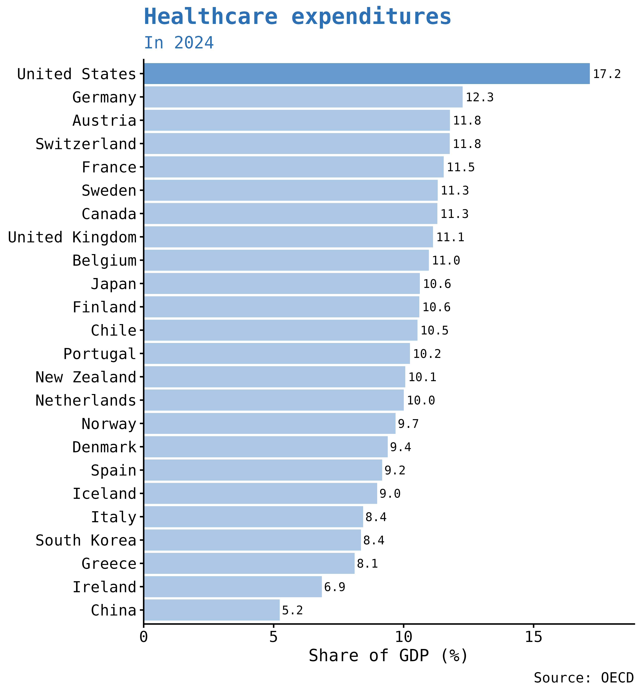
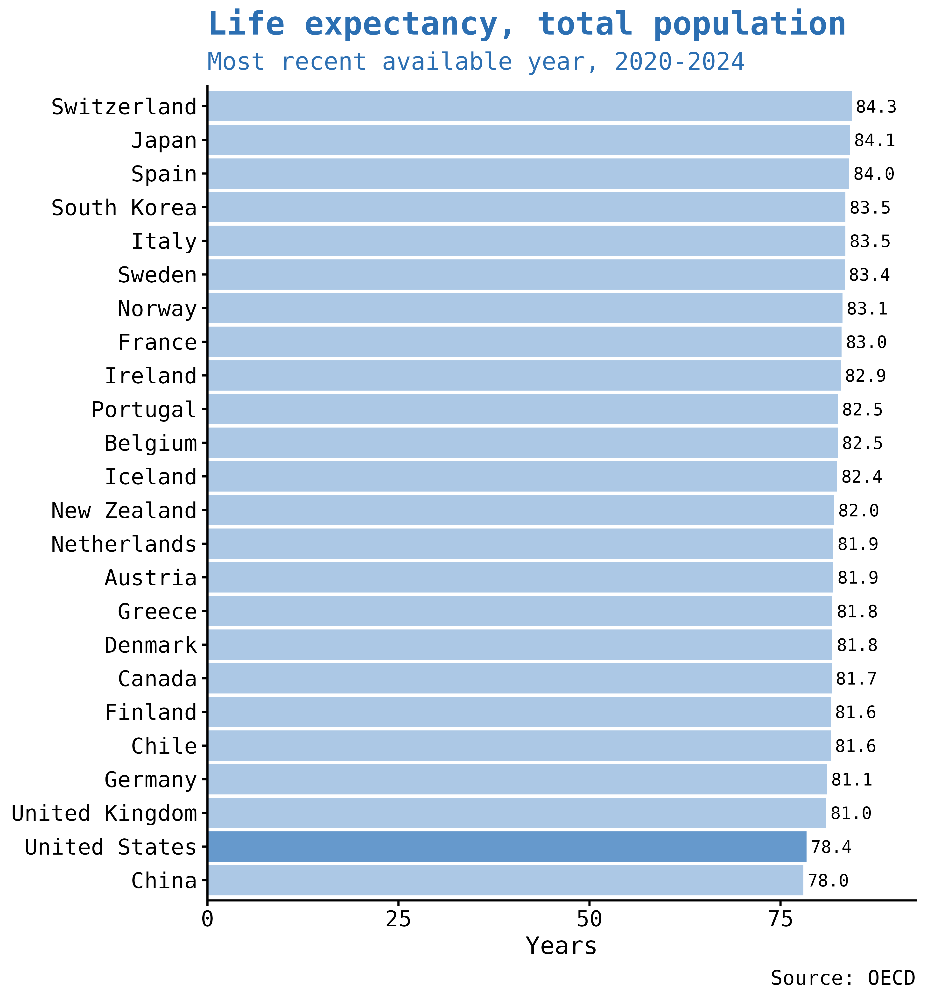
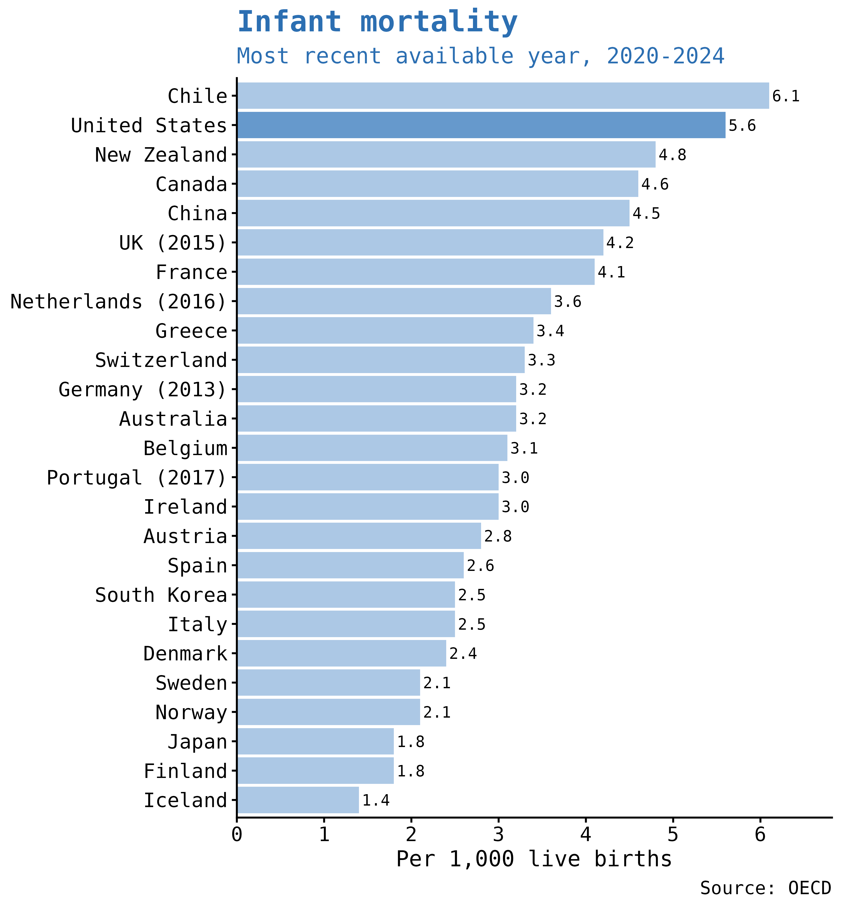
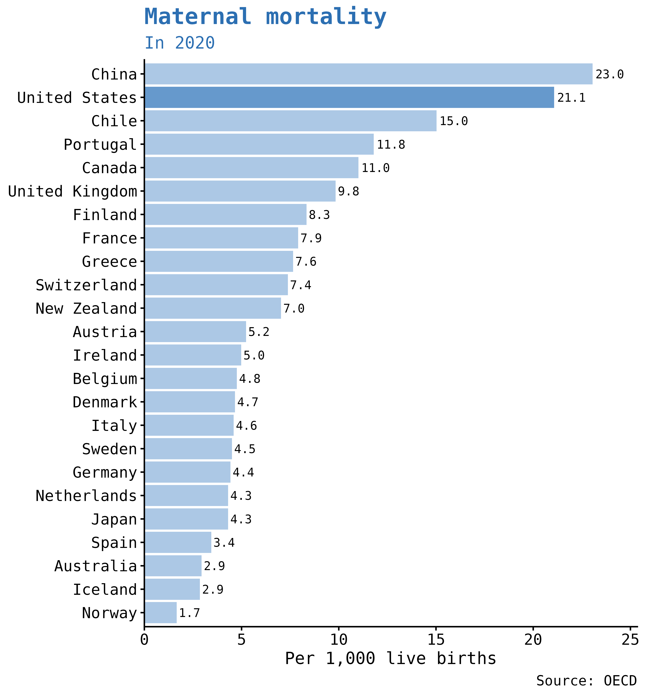

# International Health Care Comparisons
"Paying More for Less: The US Health Care System"  
Center for Economic and Policy Research  
December 10, 2025  
https://cepr.net/publications/paying-more-for-less-the-us-health-care-system/

## Healthcare expenditures

## Life expectancy

## Infant mortality

## Maternal mortality

### Data Notes

The underlying data presented here were assembled and made internationally comparable by the OECD. See https://data-explorer.oecd.org/ for data and details.

For maximum comparability, countries included were: democracies; relatively rich; and not part of the former socialist bloc countries. Including Eastern Europe countries where the data are available does not alter the relative position of the United States. To add an additional comparative element, the figures also include data for two lower-income countries, Chile and China.

Data on infant mortality do not control for some national differences in measurement. Controlling for these definitional differences does not affect the relative position of the United States, but would require excluding many of the countries in the figure.

